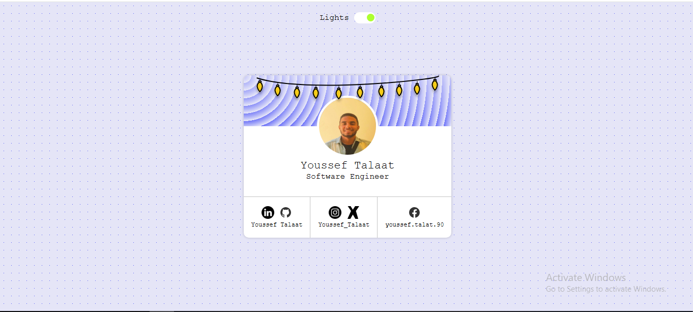

<h1 align="center">💡 Lights On/Off Profile Card</h1>

A creative and responsive <strong>HTML</strong> & <strong>CSS</strong> profile card with a fun toggle feature to switch the lights on and off. Includes social media links and a modern UI design, built entirely from scratch.

<h2>📸 Preview</h2>

  

<h2>📱 Mobile-Friendly</h2>
<ul>
  <li>✅ Fully responsive design for mobile, tablet, and desktop</li>
  <li>✅ Smooth and clean layout with centered content</li>
  <li>✅ Interactive lights toggle effect</li>
</ul>

<h2>🛠️ Tech Stack</h2>
<ul>
  <li>🧱 HTML5 (semantic markup)</li>
  <li>🎨 CSS3 (custom properties, transitions)</li>
  <li>⚡ Responsive design with Flexbox</li>
</ul>

<h2>🚀 Live Demo</h2>

🌐 View here: <a href="https://yousseftalaat-collab.github.io/Profile-card-component/" target="_blank">Live Project</a>

📂 GitHub Repo: <a href="https://github.com/Yousseftalaat-collab/Profile-card-component" target="_blank">Repository</a>

<h2>🧠 What I Practiced</h2>
<ul>
  <li>Structuring semantic HTML elements</li>
  <li>Creating responsive layouts with Flexbox</li>
  <li>Using CSS transitions for interactive UI effects</li>
</ul>

<h2>🧪 How to Run</h2>
<ol>
  <li>📥 Clone or download the repository</li>
  <li>📂 Open <code>index.html</code> in your browser</li>
  <li>✅ Done! No extra setup needed</li>
</ol>

<h2>💬 Contact</h2>

📧 Email: <a href="mailto:yousseftalaat142@gmail.com">yousseftalaat142@gmail.com</a>

🔗 LinkedIn: <a href="https://www.linkedin.com/in/youssef-talaat-1aa2671b3/">Youssef Talaat</a>

---

<h3 align="center">✨ Created & Maintained by <strong>Youssef Talaat</strong></h3>
